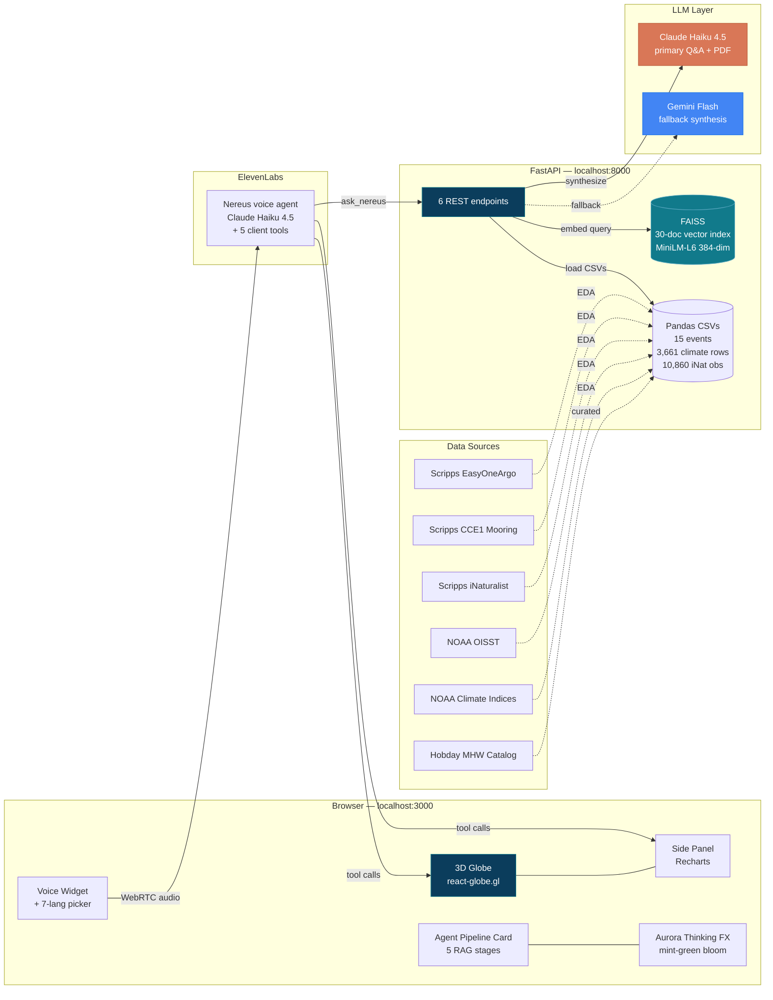
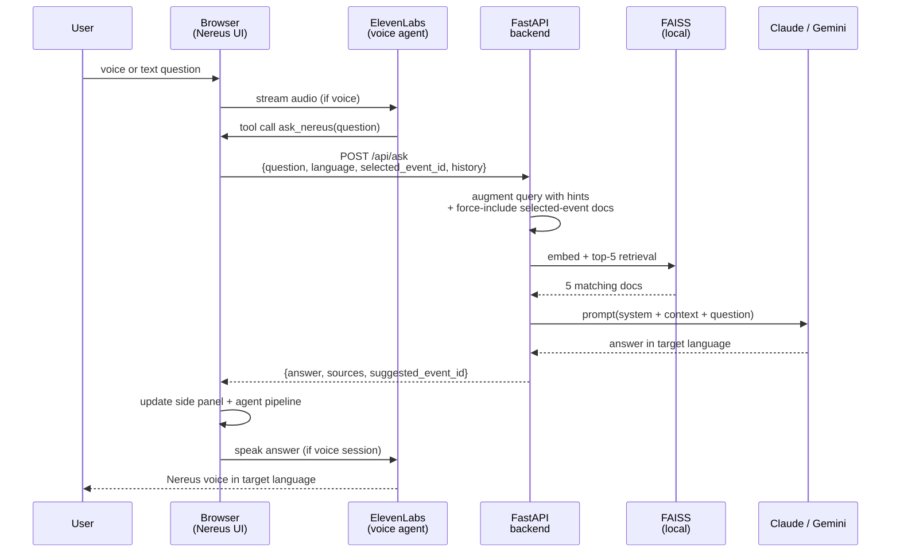
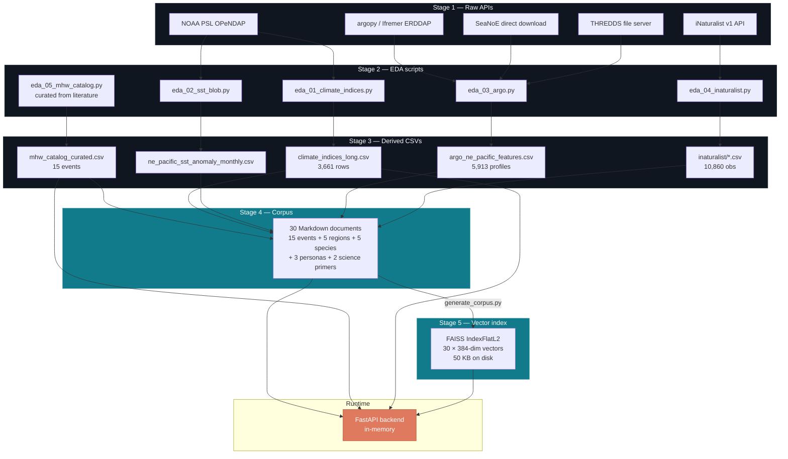

# Nereus

**A voice-driven 3D intelligence platform for marine heatwaves.**
Ask Nereus where the next marine heatwave is hitting, what happened in the last one, and what it means for aquaculture, insurance, and science — on a living 3D globe, in seven languages.

Built for **DataHacks 2026** · Scripps Institution of Oceanography theme: *Environment, Climate & Energy Sciences*.

---

## Table of contents
1. [Problem & solution](#problem--solution)
2. [Who uses Nereus](#who-uses-nereus)
3. [Impact scale](#impact-scale)
4. [System architecture](#system-architecture)
5. [Data pipeline](#data-pipeline)
6. [Datasets used](#datasets-used)
7. [Features](#features)
8. [Tech stack](#tech-stack)
9. [Setup & run](#setup--run)
10. [Demo script](#demo-script)
11. [Project structure](#project-structure)
12. [Target tracks & challenges](#target-tracks--challenges)

---

## Problem & solution

**Problem.** Marine heatwaves — periods when sea-surface temperatures exceed the 90th-percentile climatology for 5+ consecutive days (Hobday et al. 2016) — are now **20× more frequent** than four decades ago. They cost the global aquaculture industry **~$8 billion per year** in losses. A single event — the 2016 Chilean MHW-HAB — killed 27 million farmed salmon worth ~$800M. Yet **no operational system delivers multilingual, voice-driven early intelligence** at the coastal locations where operators, insurers, and regulators actually need it.

**Solution.** Nereus is a voice-driven 3D command center where users talk (or type) to an AI oceanographer in any of seven languages and get answers grounded in Scripps Argo float profiles, CCE1 mooring data, iNaturalist species observations, and peer-reviewed literature. An event-dossier side panel, a real-time agent-pipeline card, and PDF intelligence briefings complete the product.

**One-line pitch.** *"The ocean doesn't send evacuation orders. We built one."*

---

## Who uses Nereus

| Priority | User | Pain | Value Nereus delivers |
|---|---|---|---|
| **1** | **Aquaculture operator** (salmon/oyster/shrimp farms) | Loses stock when SSTs spike — no 14-day look-ahead in operator's language | Multilingual alerts + historical analog risk |
| **2** | **Parametric climate insurance underwriter** | Prices MHW policies blind — no regional probability model | Hobday-standard event catalog + climate-mode-conditional risk |
| **3** | **Marine scientist / regulator** | Loses time to data plumbing across OISST/Argo/iNat | One unified RAG interface with citations |

---

## Impact scale

- Total addressable market: **$300 B** global aquaculture
- Annual MHW-attributable losses: **~$8 B / year**
- Documented single-event loss Nereus could have helped mitigate: **$800 M** (Chile 2016, León-Muñoz et al. 2018)
- Languages supported at launch: **7** (English, हिन्दी Hindi, Español, Norsk, Bahasa, Français, Português) — reaches ~50 coastal nations
- Historical record coverage: **1982–present** via OISST, **1997–present** via EasyOneArgo

---

## System architecture



### `/api/ask` RAG flow (5 stages)



---

## Data pipeline



All six sources feed into derived CSVs (~2.2 MB total). The 30-doc Markdown corpus is hand-authored from those CSVs plus peer-reviewed citations. FAISS embeds the corpus once. The backend loads everything in-memory at startup.

---

## Datasets used

| # | Dataset | Source | Role in Nereus | Scripps? |
|---|---|---|---|---|
| 1 | **EasyOneArgo** | Scripps | Primary subsurface physics (mixed-layer depth, heat content) | ✅ |
| 2 | **CCE1 Ecosystem Mooring** | Scripps | California-coast live validation pin | ✅ |
| 3 | **iNaturalist** | Scripps / iNat | Species-impact narratives | ✅ |
| 4 | **NOAA OISST v2.1** | NOAA | Ground-truth SST for event detection | — |
| 5 | **NOAA climate indices** | NOAA PSL | ONI, PDO, NAO, AMO (causal layer) | — |
| 6 | **Curated Hobday MHW catalog** | 15 peer-reviewed papers | Event spine (Nature / Science / GRL-tier citations) | — |

Three Scripps datasets doing meaningful work — materially stronger Scripps Challenge case than typical submissions.

---

## UI layout

```
┌─────────────────────────────────────────────────────────────────┐
│                          ◈ NEREUS title pill                      │ <- top center
│                                                                   │
│                                                                   │
│                                         ┌────────────────────┐    │
│                                         │  ◈ event dossier   │    │ <- right side panel
│                                         │  +3.3°C hero       │    │
│                 [3D Earth globe]        │  climate bars      │    │
│                 15 canopies             │  species chart     │    │
│                                         │  ⬇ PDF button       │    │
│                                         └────────────────────┘    │
│                                                                   │
│                                          ┌─ 🔍 agent pipeline ┐   │ <- top-right during query
│                                          │  embed → search →  │   │
│                                          │  retrieve → LLM    │   │
│                                          └────────────────────┘   │
│                                                                   │
│                    ┌──────────────────────────────┐               │
│                    │  🎙  [ Ask Nereus… ]  [Ask]  │               │ <- bottom voice widget
│                    │  ● ready  · 🔊 voice on  🌐  │               │
│                    └──────────────────────────────┘               │
│                                                                   │
│  ▓▓▓▓▓▓▓▓▓▓▓ mint-green aurora bloom when thinking ▓▓▓▓▓▓▓▓▓▓    │ <- bottom edge
└─────────────────────────────────────────────────────────────────┘
```

---

## Features

| Feature | Description |
|---|---|
| **3D Earth globe** | react-globe.gl with blue-marble texture, 15 extruded stained-glass "canopy" polygons at heatwave regions. Click a polygon or voice-command to fly + zoom. Selected event rockets to 8× altitude with a bright anomaly cap |
| **Nereus AI voice agent** | ElevenLabs Conversational AI widget running Claude Haiku 4.5. One-click 🎙 mic button starts a WebRTC voice session; 5 client tools drive the globe: `fly_to_event`, `ask_nereus`, `compare_events`, `generate_report`, `reset_view` |
| **7-language output** | English, Hindi (Devanagari), Spanish, Norwegian, Bahasa Indonesia, French, Portuguese. Compact pill picker in the widget. Response language is independent of input language |
| **Event dossier side panel** | Right side. Category badge, hero "+X.X°C" anomaly card with severity gradient bar, climate-mode pills + bar chart (ONI/PDO/NAO/AMO), species-impact bar chart, gradient "Generate PDF briefing" CTA, peer-reviewed citation footer. Also renders Nereus's Q&A answers inline after each turn |
| **Agent pipeline card** | Top-right. Five real-time stages light up per query: 🧭 embed → 🔍 FAISS search → 📚 retrieve → ⚡ invoke LLM → ✍️ compose |
| **Oceanic aurora effect** | Bottom-of-screen mint-green radial bloom while Nereus thinks or speaks. Environment-theme color (not ocean-blue) to signal the DataHacks climate theme |
| **PDF intelligence briefings** | Claude-generated 400-700 word structured reports: executive summary, physical signature, ecological and economic impact, analog events, recommended action, primary source citation |
| **Resilient LLM layer** | Three tiers: Claude Haiku 4.5 primary → Gemini Flash fallback → deterministic CSV-based briefing fallback. PDFs never blank; Q&A never fails |
| **Forced event retrieval** | When a user selects an event on the globe OR mentions an event name (English or non-English), those specific docs are force-injected into Claude's context so Nereus never falsely says "I don't have info" about an event that IS in the catalog |

---

## Tech stack

| Layer | Tool |
|---|---|
| **Frontend** | Next.js 14, React 18, TypeScript, Tailwind CSS |
| **3D** | react-globe.gl (Three.js under the hood) |
| **State** | Zustand |
| **Charts** | Recharts |
| **Voice** | ElevenLabs Conversational AI (WebRTC widget), browser `SpeechSynthesis` fallback |
| **Voice-layer LLM** | Anthropic Claude Haiku 4.5 (via ElevenLabs) |
| **RAG LLM** | Anthropic Claude Haiku 4.5 (primary) + Google Gemini Flash (fallback) |
| **Backend** | FastAPI on uvicorn |
| **Vector search** | FAISS IndexFlatL2, `sentence-transformers/all-MiniLM-L6-v2` (384-dim) |
| **PDF** | `markdown-pdf` |
| **Data** | Pandas CSVs; NetCDF via `xarray` / `netCDF4` (for Argo + mooring) |
| **GPU (optional)** | NVIDIA Brev.dev for corpus embedding at scale (see `brev/`) |

Zero cloud databases. Total on-disk footprint under 20 MB. Entire intelligence layer runs on a laptop.

---

## Setup & run

### Prerequisites
- Python 3.10+
- Node.js 18+
- API keys: Gemini (Google AI Studio), Anthropic, ElevenLabs Agent ID

### Backend

```bash
cd Nereus/backend
pip3 install -r requirements.txt --break-system-packages
python3 build_index.py          # builds nereus.faiss + docs.json (~30 s)
python3 -m uvicorn main:app --reload --port 8000
```

Startup log confirms: `[startup] Claude ready`, `[startup] using Gemini model`, `[startup] ready. docs=30 events=15`.

### Frontend

```bash
cd Nereus/frontend
cp .env.local.example .env.local   # paste your keys
npm install
npm run dev                        # http://localhost:3000
```

### `.env.local` fields

```
GEMINI_API_KEY=AIza...
ANTHROPIC_API_KEY=sk-ant-...
ELEVENLABS_AGENT_ID=agent_...

# frontend only
NEXT_PUBLIC_ELEVENLABS_AGENT_ID=agent_...
NEXT_PUBLIC_API_BASE=http://localhost:8000
```

> **ElevenLabs setup.** You need to create your own Conversational AI agent at [elevenlabs.io/app/agents](https://elevenlabs.io/app/agents) and copy the agent ID into both `ELEVENLABS_AGENT_ID` (root `.env.local`) and `NEXT_PUBLIC_ELEVENLABS_AGENT_ID` (frontend `.env.local`). In the agent's dashboard, register the five client tools Nereus dispatches — `fly_to_event`, `ask_nereus`, `compare_events`, `generate_report`, `reset_view` — so voice commands can drive the globe.

---

## Demo script

Seven canonical questions. Each builds on the previous turn's context.
Use either text input (press Enter) or click the 🎙 button for voice.

| # | Question | Tests |
|---|---|---|
| 1 | *"Tell me about the Pacific Blob"* | Event lookup, globe fly, side panel opens |
| 2 | *"What was the climate state?"* | Follow-up context resolution (no event named) |
| 3 | *"Which species were affected?"* | Species-impact retrieval, still grounded in Blob |
| 4 | *"Compare it to Chile 2016"* | `compare_events` tool + arc animation |
| 5 | *"Generate a report"* | Claude-generated PDF briefing downloads |
| 6 | *Switch language picker to हिन्दी*<br/>*"प्रशांत ब्लॉब के बारे में बताइए"* | Multilingual output (Devanagari) rendered in the side panel + voice reply |
| 7 | *"Who uses Nereus?"* | Persona docs, product pitch — closes the demo |

**Voice flow:** click 🎙 → allow mic → speak the question → Nereus answers in his ElevenLabs voice.
**Text flow:** type in the chat bar → press Enter → Nereus answers, browser TTS reads it aloud.

---

## Project structure

```
Nereus/
├── README.md                     This file
├── .env.local.example            Template with all API key slots
├── .gitignore
├── brev/                         NVIDIA Brev.dev GPU pipeline (batch mode)
│   ├── brev_pipeline.py
│   ├── requirements-brev.txt
│   └── README.md
├── backend/                      FastAPI runtime
│   ├── main.py                   6 endpoints: /api/ask, /api/globe-data, /api/event/{id}, /api/compare, /report, /health
│   ├── build_index.py            One-time FAISS index builder
│   ├── requirements.txt
│   ├── nereus.faiss              Vector index (generated)
│   └── docs.json                 Corpus manifest (generated)
├── frontend/                     Next.js UI
│   ├── package.json
│   ├── next.config.mjs
│   ├── tailwind.config.ts
│   └── src/
│       ├── app/
│       │   ├── page.tsx          Main layout
│       │   ├── layout.tsx
│       │   └── globals.css       Tailwind + aurora keyframes
│       ├── components/
│       │   ├── Globe.tsx           react-globe.gl wrapper, canopies, labels, rings
│       │   ├── SidePanel.tsx       Right-hand event dossier + Nereus Q&A view
│       │   ├── VoiceWidget.tsx     ElevenLabs widget, 🎙 button, 7-lang picker, chat bar
│       │   ├── ThinkingEffect.tsx  Mint-green aurora bloom at bottom
│       │   ├── AgentActivity.tsx   5-stage RAG pipeline card (top-right)
│       │   ├── KnowledgeGraph.tsx  (not mounted — scaffolding kept out of the UI)
│       │   └── TranscriptPanel.tsx (not mounted — scaffolding kept out of the UI)
│       ├── lib/api.ts            Typed client for FastAPI
│       └── store.ts              Zustand global state
├── corpus/                       30 Markdown knowledge documents
│   ├── event_*.md                × 15
│   ├── region_*.md               × 5
│   ├── species_*.md              × 5
│   ├── persona_*.md              × 3
│   └── science_*.md              × 2
└── data/                         Pre-computed CSVs (< 3 MB total)
    ├── mhw_catalog_curated.csv
    ├── climate_indices_long.csv
    ├── ne_pacific_sst_anomaly_monthly.csv
    ├── argo_ne_pacific_features.csv
    └── inaturalist/*.csv
```

---

## Target tracks & challenges

| Track / Challenge | Prize | What Nereus earns it with |
|---|---|---|
| **ML/AI Track** | $5,000 pool | Real RAG pipeline: MiniLM embeddings, FAISS, Claude+Gemini multi-LLM synthesis, multilingual output across 7 languages |
| **Product & Entrepreneurship** | $2,500 pool | Three-persona market thesis (aquaculture, insurance, scientist), $8B/year TAM, 7-language reach, PDF briefings sellable to underwriters |
| **Scripps Challenge** | $1,500 | Three Scripps datasets (EasyOneArgo, CCE1, iNaturalist) in meaningful roles — not checkbox compliance |
| **NVIDIA Brev.dev** | $500 | `brev/` folder with GPU batch pipeline for corpus embedding at scale |
| **AWS** | $1,000 | Backend deployable to EC2 / Elastic Beanstalk |
| **ElevenLabs (MLH)** | Earbuds | Core voice-agent stack with 5 client tools + multilingual voice |
| **Gemini API (MLH)** | Swag | Gemini Flash primary synthesis path |
| **Best Use of [X] Data** | $1,500 | Unambiguous — Nereus is the oceanographic-data entry |

Total target pool addressed: **~$14,000 across 8 categories.**

---

## Credits & acknowledgements

- **Hobday et al. 2016** — the definitive marine heatwave taxonomy that underpins the event catalog
- **Bond et al. 2015; Di Lorenzo & Mantua 2016** — NE Pacific Blob characterization
- **León-Muñoz et al. 2018** — Chile 2016 MHW-HAB economic loss documentation
- **Scripps Institution of Oceanography** — EasyOneArgo, CCE1 mooring, iNaturalist
- **NOAA** — OISST, climate-mode indices
- **ElevenLabs, Anthropic, Google** — inference layers
- **DataHacks 2026** — the theme and the challenge

Built solo in one weekend by **Hemakshi**.

---

> *"The ocean doesn't send evacuation orders. We built one."*
